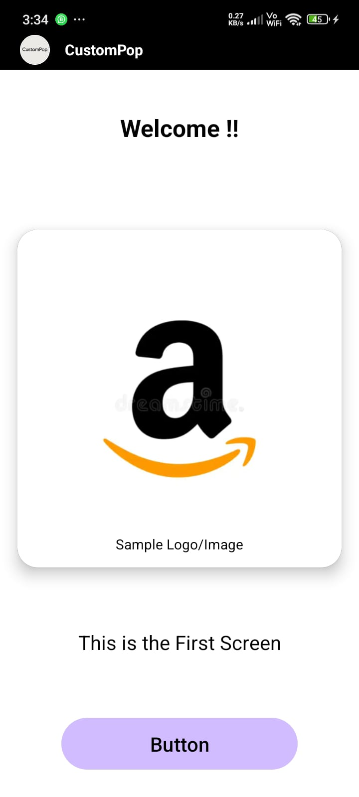
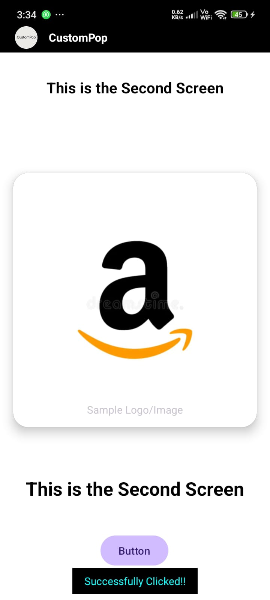
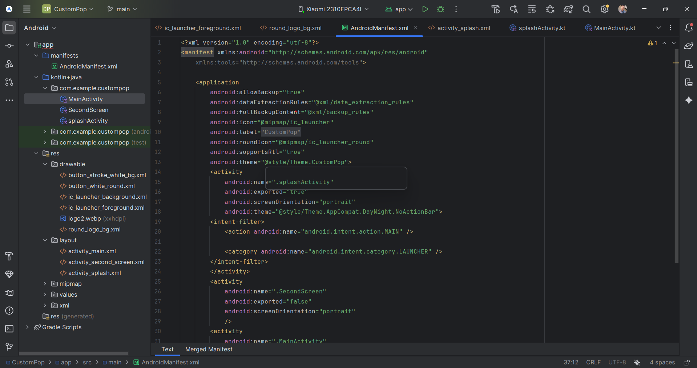
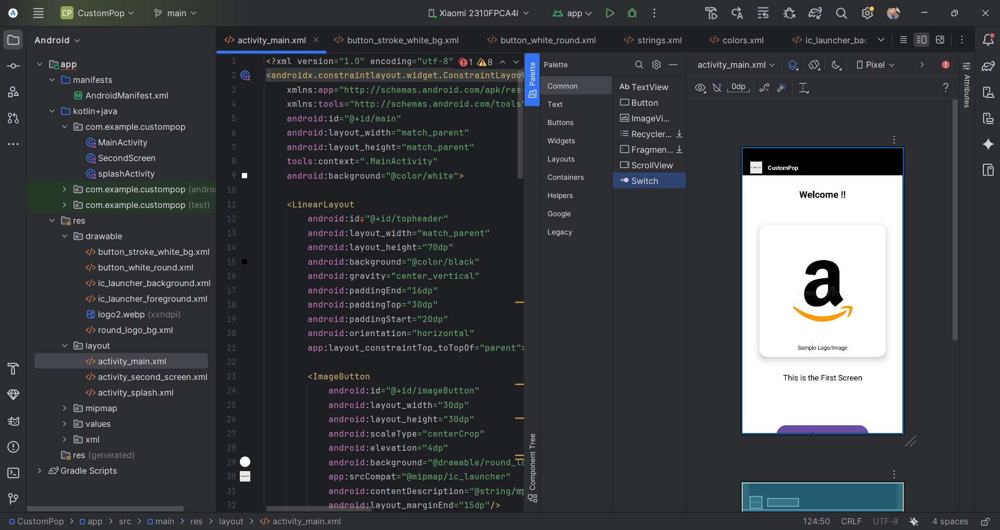

# CustomPop Android Application

Welcome to the CustomPop Android application! This project demonstrates a foundational Android app built with Kotlin, featuring a multi-screen user experience with interactive elements.

## Features

* **Custom Header:** A visually appealing top header with a rounded logo and the app name "CustomPop".
* **CardView Integration:** Displays an image and descriptive text within a modern CardView component, complete with shadows for depth.
* **Navigation:** Seamless navigation from the first screen to a second screen.
* **Interactive Toast Message:** The second screen demonstrates user interaction by displaying a "Successfully Clicked !!" Toast message upon button press.

## Technologies Used

* **Kotlin:** The primary programming language for Android development.
* **Android SDK:** Core Android libraries and tools.
* **XML:** For defining UI layouts.

* ## 📄 Project Documentation Preview

<embed src="CustomPop.pdf" width="100%" height="600px" />


* ## 📄 Project Report (PDF)

[📘 View Documentation](CustomPop.pdf)


## 📸 Project Screenshots

| Screenshot 1 | Screenshot 2 |
|--------------|--------------|
|  |  |

| Screenshot 3 | Screenshot 4 |
|--------------|--------------|
|  |  |


## Getting Started

To run this project, clone the repository and open it in Android Studio.

```bash
git clone [https://github.com/deepakdotdevs/CustomPop-Android-Navigation-Demo]
